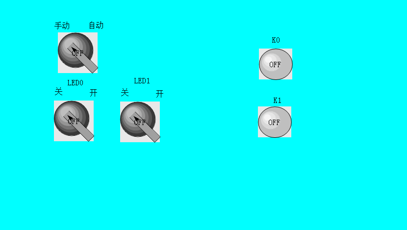
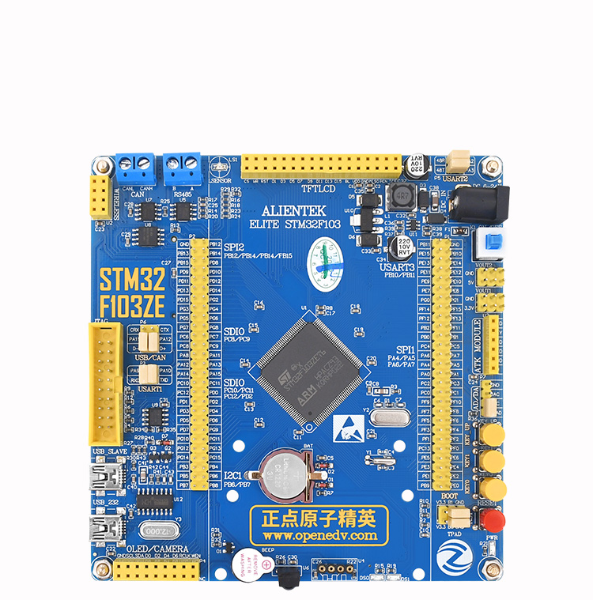

## 要求

1. 单片机上的按钮控制屏幕灯的亮灭，屏幕的开关分两个，自动状态下板子上的两个灯闪烁，手动状态下开关控制每个灯的亮灭

就是按照这个显示屏来 ，最上面的那个开关 它来选择手动或是自动的方式 

自动方式情况下 ，板子上的两个灯交替闪烁 就是按照跑马灯的方式亮就行 

手动方式的情况下 ，通过下边的两个按钮去控制灯亮 

然后右边两个显示灯 ，是需要板子上的两个k0和k1去点亮的

我导师还想要一个温度显示 ，板子上有温度传感器 想加一个数值显示可以显示到 小数点后两位 

  